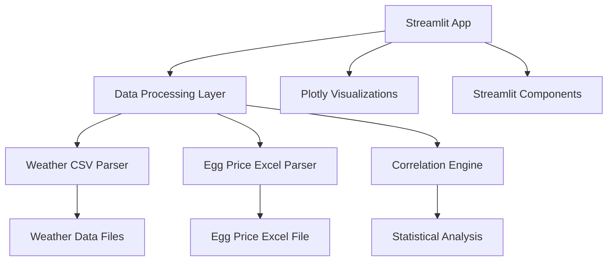

# Design Document

## Overview

The Data Weaver Dashboard is a modern web application built with Streamlit that analyzes correlations between weather patterns and egg prices across eight major Indian cities. The system processes historical weather data from CSV files (1951-2024) and egg price data from Excel files (1982-2025) to generate interactive visualizations and statistical insights.

The application follows a single-page Streamlit architecture with integrated data processing, visualization, and user interaction components. The system emphasizes ease of use, interactive data exploration, and statistical accuracy in correlation analysis.

## Architecture

### High-Level Architecture



### Technology Stack

- **Framework**: Streamlit for web application and UI components
- **Data Processing**: Pandas for data manipulation, openpyxl for Excel files
- **Visualization**: Plotly for interactive charts and graphs
- **Statistical Analysis**: SciPy and NumPy for correlation calculations
- **Deployment**: Streamlit Cloud or local development server

### Deployment Architecture

- **Development**: Local Streamlit server with auto-reload
- **Production**: Streamlit Cloud deployment with GitHub integration

## Components and Interfaces

### Streamlit Application Structure

#### 1. Main Application (`app.py`)
- **Purpose**: Main Streamlit application entry point
- **Components**: Sidebar controls, main content area, data caching
- **Functions**: `main()`, `load_data()`, `setup_sidebar()`, `display_dashboard()`

#### 2. Data Processing Module (`data_processor.py`)
- **Purpose**: Handle data loading, cleaning, and preprocessing
- **Functions**:
  - `load_weather_data(cities: List[str]) -> pd.DataFrame`
  - `load_egg_price_data() -> pd.DataFrame`
  - `merge_datasets(weather_df: pd.DataFrame, price_df: pd.DataFrame) -> pd.DataFrame`
  - `filter_by_date_range(df: pd.DataFrame, start_date: date, end_date: date) -> pd.DataFrame`

#### 3. Visualization Module (`visualizations.py`)
- **Purpose**: Create interactive Plotly charts and graphs
- **Functions**:
  - `create_correlation_scatter(df: pd.DataFrame, x_col: str, y_col: str) -> plotly.graph_objects.Figure`
  - `create_time_series_chart(df: pd.DataFrame, cities: List[str]) -> plotly.graph_objects.Figure`
  - `create_correlation_heatmap(correlations: pd.DataFrame) -> plotly.graph_objects.Figure`
  - `create_extreme_weather_analysis(df: pd.DataFrame) -> plotly.graph_objects.Figure`

#### 4. Statistical Analysis Module (`statistics.py`)
- **Purpose**: Calculate correlations and statistical insights
- **Functions**:
  - `calculate_correlations(df: pd.DataFrame) -> pd.DataFrame`
  - `find_significant_correlations(correlations: pd.DataFrame, alpha: float = 0.05) -> pd.DataFrame`
  - `generate_insights(df: pd.DataFrame, correlations: pd.DataFrame) -> List[str]`
  - `detect_extreme_weather_events(df: pd.DataFrame) -> pd.DataFrame`

#### 5. Utility Module (`utils.py`)
- **Purpose**: Helper functions for data formatting and validation
- **Functions**:
  - `format_correlation_value(correlation: float) -> str`
  - `validate_date_range(start_date: date, end_date: date) -> bool`
  - `get_available_cities() -> List[str]`
  - `export_data_to_csv(df: pd.DataFrame, filename: str) -> str`

## Data Models

### Weather Data Model (Pandas DataFrame)
```python
# Weather DataFrame columns:
# - date: datetime64[ns] - Date of observation
# - city: str - City name (Chennai, Bengaluru, Delhi, etc.)
# - rain: float64 - Rainfall in mm
# - temp_max: float64 - Maximum temperature in Celsius
# - temp_min: float64 - Minimum temperature in Celsius
# - temp_avg: float64 - Calculated average temperature
```

### Egg Price Data Model (Pandas DataFrame)
```python
# Egg Price DataFrame columns:
# - date: datetime64[ns] - Date of price observation
# - price: float64 - Price per dozen eggs in INR
# - region: str - Regional identifier (optional)
```

### Correlation Result Model (Pandas DataFrame)
```python
# Correlation DataFrame columns:
# - city: str - City name
# - weather_metric: str - Weather parameter (rain, temp_max, temp_min, temp_avg)
# - correlation: float64 - Pearson correlation coefficient (-1 to 1)
# - p_value: float64 - Statistical significance value
# - sample_size: int64 - Number of data points used
# - is_significant: bool - Whether p < 0.05
```

### Combined Data Model (Pandas DataFrame)
```python
# Combined DataFrame columns:
# - date: datetime64[ns] - Date
# - city: str - City name
# - rain: float64 - Rainfall in mm
# - temp_max: float64 - Maximum temperature
# - temp_min: float64 - Minimum temperature
# - temp_avg: float64 - Average temperature
# - egg_price: float64 - Egg price per dozen in INR
```

## Correctness Properties

*A property is a characteristic or behavior that should hold true across all valid executions of a system-essentially, a formal statement about what the system should do. Properties serve as the bridge between human-readable specifications and machine-verifiable correctness guarantees.*

### Property Reflection

After reviewing all properties identified in the prework, I've identified several areas where properties can be consolidated:

**Redundancy Analysis:**
- Properties 1.1 and 1.4 both test data filtering and display - these can be combined into a comprehensive data filtering property
- Properties 2.1 and 2.4 both test correlation detection and insight generation - these can be combined
- Properties 4.1 and 4.2 both test file parsing - these can be combined into a general file parsing property
- Properties 5.1, 5.2, and 5.3 all test export functionality - these can be combined into a comprehensive export property

**Consolidated Properties:**
The following properties provide unique validation value and will be implemented:

Property 1: Data filtering and display completeness
Property 2: Correlation calculation accuracy  
Property 3: Statistical significance detection
Property 4: Data alignment and synchronization
Property 5: File parsing and normalization
Property 6: Export functionality and integrity
Property 7: Error handling and user feedback
Property 8: UI interaction responsiveness

### Correctness Properties

Property 1: Data filtering and display completeness
*For any* valid city selection and date range, the system should return data that contains only the selected cities, falls within the specified date range, and includes both weather metrics (rain, temperature) and egg price information for each data point
**Validates: Requirements 1.1, 1.4**

Property 2: Correlation calculation accuracy
*For any* dataset with weather and price data, calculated correlation coefficients should fall within the valid range of -1 to 1, and the correlation calculation should be mathematically correct according to Pearson correlation formula
**Validates: Requirements 1.3**

Property 3: Statistical significance detection
*For any* correlation analysis, relationships with p-values less than 0.05 should be marked as statistically significant, and those with p-values greater than or equal to 0.05 should not be marked as significant
**Validates: Requirements 1.5, 2.4**

Property 4: Data alignment and synchronization
*For any* combined weather and price dataset, all data points should be properly aligned by date, and missing values should be handled consistently without corrupting the time series alignment
**Validates: Requirements 1.2, 4.3**

Property 5: File parsing and normalization
*For any* valid CSV or Excel file, the parsing process should extract all data correctly, normalize formats consistently across different cities, and produce standardized data structures
**Validates: Requirements 4.1, 4.2**

Property 6: Export functionality and integrity
*For any* export request, the generated files should contain exactly the filtered data currently displayed, maintain data integrity, and include appropriate metadata about the analysis parameters
**Validates: Requirements 5.1, 5.2, 5.3**

Property 7: Error handling and user feedback
*For any* invalid input, missing data, or system error, the system should provide clear, actionable error messages and suggest appropriate alternatives without crashing
**Validates: Requirements 3.5, 4.4**

Property 8: UI interaction responsiveness
*For any* user interaction with charts or controls, the system should update visualizations without full page refreshes and maintain interactive state consistency
**Validates: Requirements 2.5, 3.2, 3.4**

## Error Handling

### Data Processing Errors
- **Missing Files**: Graceful degradation when weather or price data files are unavailable
- **Corrupted Data**: Validation and error reporting for malformed CSV/Excel files
- **Date Misalignment**: Handling of gaps in time series data between weather and price datasets
- **Invalid Correlations**: Detection and handling of insufficient data for correlation analysis

### User Input Errors
- **Invalid Date Ranges**: Validation of start/end dates and logical date ordering
- **Empty City Selection**: Prevention of analysis with no cities selected
- **Extreme Date Ranges**: Performance protection for very large date ranges

### System Errors
- **Memory Limitations**: Chunked processing for large datasets
- **Network Failures**: Retry logic and offline capability for static data
- **Browser Compatibility**: Fallback visualizations for unsupported browsers

## Testing Strategy

### Dual Testing Approach

The system will implement both unit testing and property-based testing to ensure comprehensive coverage:

**Unit Testing Requirements:**
- Unit tests verify specific examples, edge cases, and error conditions
- Focus on integration points between data processing components
- Test specific scenarios like empty datasets, single data points, and boundary conditions
- Validate UI component rendering with known data sets

**Property-Based Testing Requirements:**
- Property tests verify universal properties across all valid inputs using **hypothesis** library for Python
- Each property-based test will run a minimum of 100 iterations to ensure statistical confidence
- Property tests will use intelligent generators that create realistic weather and price data
- Each property-based test will be tagged with comments referencing the design document property

**Property-Based Test Implementation:**
- Library: hypothesis (Python property-based testing library)
- Minimum iterations: 100 per property test (configured via hypothesis settings)
- Test tagging format: `**Feature: data-weaver-dashboard, Property {number}: {property_text}**`
- Each correctness property will be implemented by exactly one property-based test

**Test Data Generation:**
- Weather data generators: realistic temperature ranges (-10°C to 50°C), rainfall (0-500mm)
- Date generators: valid date ranges within historical data bounds (1951-2025)
- City generators: selection from the 8 supported cities
- Price generators: realistic egg price ranges based on historical data

**Integration Testing:**
- End-to-end testing of complete data pipeline from file parsing to visualization
- Cross-browser testing for visualization compatibility
- Performance testing with large datasets (10,000+ records)

### Testing Framework Configuration
- **Python Testing**: pytest for unit tests, hypothesis for property-based testing
- **Data Testing**: pandas testing utilities for DataFrame validation
- **Streamlit Testing**: streamlit-testing for UI component testing
- **Coverage**: Minimum 80% code coverage for critical data processing functions